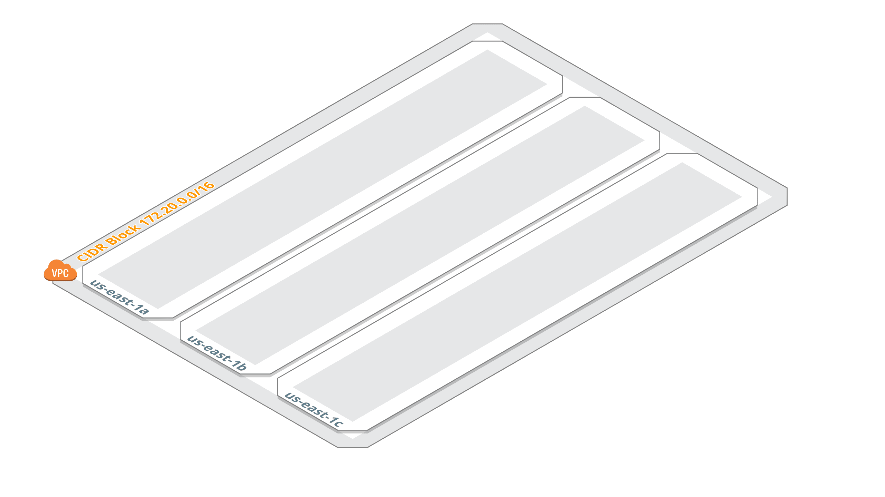
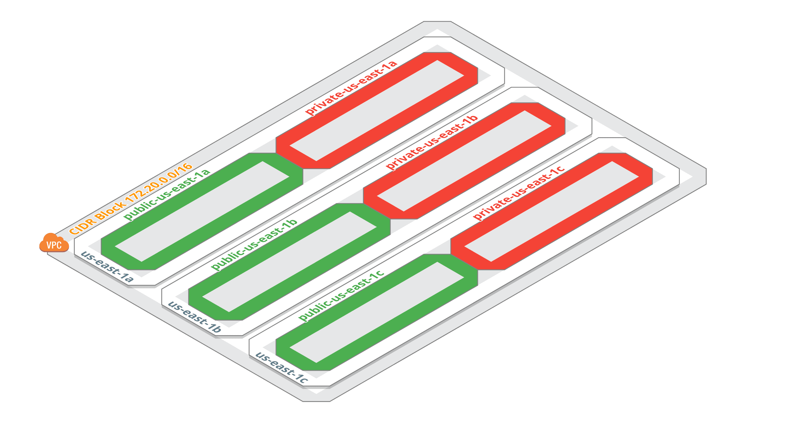
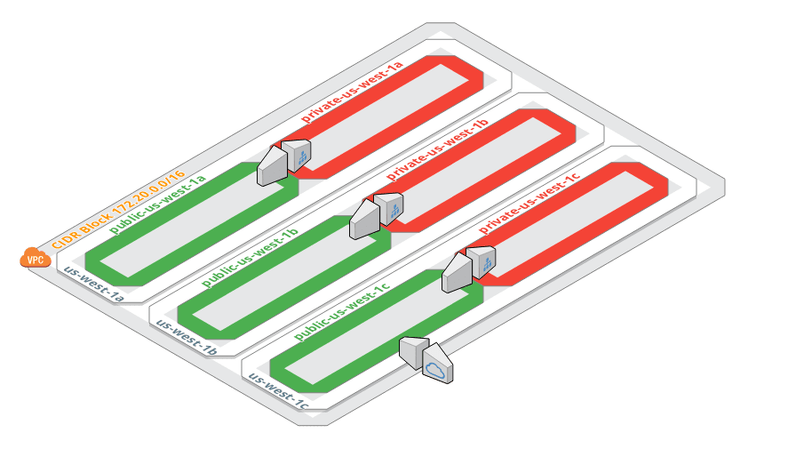
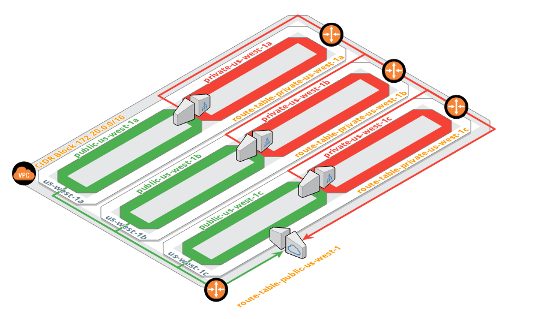

# Terraform AWS VPC

## :package: Install Terraform

Install Terraform by following the [documentation](https://www.terraform.io/downloads.html)

Make sure `terraform` is working properly

```hcl
$ terraform
Usage: terraform [--version] [--help] <command> [args]

The available commands for execution are listed below.
The most common, useful commands are shown first, followed by
less common or more advanced commands. If you're just getting
started with Terraform, stick with the common commands. For the
other commands, please read the help and docs before usage.

Common commands:
    apply              Builds or changes infrastructure
    console            Interactive console for Terraform interpolations
# ...
```

*Based on [standard module structure](https://www.terraform.io/docs/modules/create.html#standard-module-structure) guidelines*

## :triangular_ruler: Naming Convention

Common variables referenced in naming standards

| Variable              | RegExp                          | Example                                                     |
|:----------------------|:--------------------------------|:------------------------------------------------------------|
| `<availability_zone>` | `[a-z]{2}-[a-z]{1,}-[1-2][a-f]` | `us-east-1a`, `us-west-2c`, `eu-west-1a`, `ap-northeast-1c` |

---

## AWS - Resource Naming Standards

| AWS Resource     | Resource Naming                          | Comment | Example                          |
|:-----------------|:-----------------------------------------|:--------|:---------------------------------|
| VPC              | `<vpc_name>-vpc`                         |         | `mycloud-vpc`                    |
| Subnets          | `<vpc_name>-private-<availability_zone>` |         | `mycloud-private-us-east-1b` |
|                  | `<vpc_name>-public-<availability_zone>`                      |         | `mycloud-public-us-east-1b`             |
| Route Tables     | `<vpc_name>-private-<availability_zone>` |         | `mycloud-private-us-east-1b` |
|                  | `<vpc_name>-public`                      |         | `mycloud-public`             |
| Internet Gateway | `<vpc_name>-igw`                         |         | `mycloud-igw`                |
| Nat Gateway      | `<vpc_name>-nat-<availability_zone>`     |         | `mycloud-nat-us-east-1b`     |


## 1. Create a `VPC`

The really first stage for bootstrapping an AWS account is to create a `VPC`

* [aws_vpc](https://www.terraform.io/docs/providers/aws/r/vpc.html)



## 2. Create `public` and `private` Subnets

Then create `public` and `private` subnets in each `AZs` (`us-east-1a`, `us-east-1b`, `us-east-1c`)

* [aws_subnet](https://www.terraform.io/docs/providers/aws/r/subnet.html)



## 3. Create `internet` and `nat` Gateways

Create one `internet gateway` so that the `VPC` can communicate with the outisde world. For instances located in `private` subnets, we will need `NAT` instances to be setup in each `availability zones`

* [aws_internet_gateway](https://www.terraform.io/docs/providers/aws/r/internet_gateway.html)
* [aws_ami](https://www.terraform.io/docs/providers/aws/d/ami.html)
    * > :point_up: Use the following AMI Name `amzn-ami-vpc-nat-2018.03.0.2021*` provided by Amazon (owners = `amazon`)
* [aws_security_group](https://registry.terraform.io/providers/hashicorp/aws/latest/docs/resources/security_group)
    * > :warning: Do not use inline `ingress` or `egress`, use [aws_security_group_rule](https://registry.terraform.io/providers/hashicorp/aws/latest/docs/resources/security_group_rule)
* [aws_key_pair](https://www.terraform.io/docs/providers/aws/r/key_pair.html)
* [aws_instance](https://www.terraform.io/docs/providers/aws/r/instance.html)
    * > :warning: Make sure you use `vpc_security_group_ids` and not `security_groups`
    * > :warning: Make sure to set `source_dest_check = false`. [Read more about it here](https://docs.aws.amazon.com/fr_fr/vpc/latest/userguide/VPC_NAT_Instance.html#EIP_Disable_SrcDestCheck)
* [aws_eip](https://www.terraform.io/docs/providers/aws/r/eip.html)
* [aws_eip_association](https://www.terraform.io/docs/providers/aws/r/eip_association.html)



## 4. Create `route tables` and `routes`

Finaly, link the infrastructure together by creating `route tables` and `routes` so that servers from `public` and `private` subnets can send their traffic to the respective gateway, either the `internet gateway` or the `NAT` ones.

* [aws_route_table](https://www.terraform.io/docs/providers/aws/r/route_table.html)
* [aws_route](https://www.terraform.io/docs/providers/aws/r/route.html)
* [aws_route_table_association](https://www.terraform.io/docs/providers/aws/r/route_table_association.html)



## Tips and Tricks

* Connect to AWS private instance using a NAT server as a jumphost

```sh
eval $(ssh-agent)
ssh-add <keypair.pem>
ssh -i key-pair/aws-educate-student.pem -J ec2-user@<public-NAT-IP> -A ec2-user@<private-EC2-IP>
```
